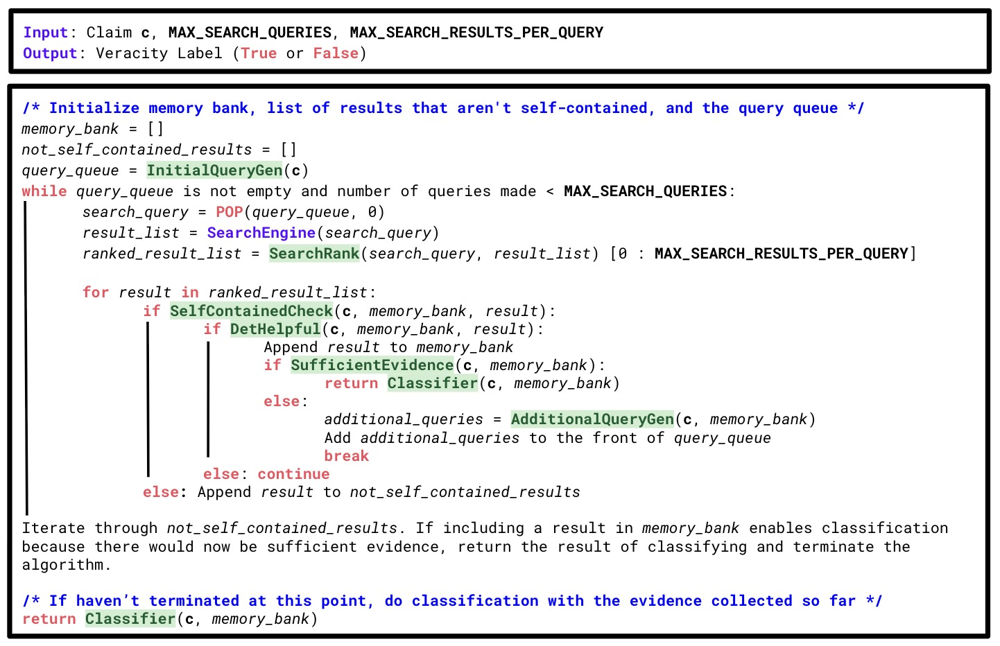

# EMULATE: A Multi-Agent Framework for Determining the Veracity of Atomic Claims by Emulating Human Actions


This is the official repository for [***EMULATE: A Multi-Agent Framework for Determining the Veracity of Atomic Claims by Emulating Human Actions***](https://arxiv.org/pdf/2505.16576), which was accepted at FEVER 2025 (co-located with ACL 2025).
  




To run the code, first create a virtual environment with Python 3.10.0 and install all necessary dependencies by doing the following:
```
python3 -m venv venv
. venv/bin/activate
pip install -r requirements.txt
```

You will need API keys for the OpenAI API and serper.dev. These API keys will need to be placed in a INI config file (an ordinary file with ".ini" as the extension) with the following content:

```
[BASIC]
SERPER_API_KEY = <Serper_API_Key>
OPENAI_API_KEY = <OpenAI_API_Key>
```

The datasets from the paper can be found in the `datasets` folder, and all CSV files follow the same format: 
```
"claim": the claim/text
"label": the ground truth label (true or false)
"id": unique identifier for each row in a CSV file
```

You can run EMULATE on a dataset by invoking `cli.py` as follows:
```
python3 cli.py --max_search_queries 4 --max_search_results_per_query 2 --dataset datasets/bingcheck_sampled.csv --openai_model_name gpt-4.1-2025-04-14 --json_pred_path predictions.json
```
You may also need to specify the `--credentials_path` if it is not the default value.

Evaluation is done with `eval.ipynb` by providing the name of the json file with the predictions (outputted by `cli.py`) and the path to the dataset in `datasets`.
